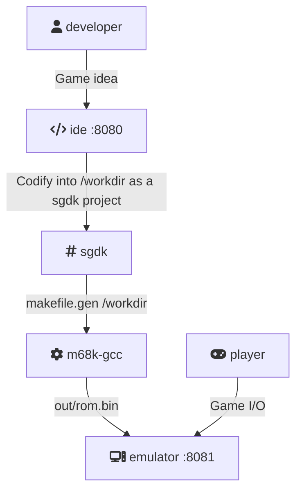

# Genesis IDE

Genesis **I**ntegrated **D**evelopment **E**nvironment with [Visual Studio Code](https://code.visualstudio.com), [SGDK](https://github.com/Stephane-D/SGDK), [Gens](http://www.gens.me) and [Retroarch](https://www.retroarch.com)

### How does it work



### Prerequirement
* Docker 23+

### How to start

```shell
docker compose up -d
```
Then access

[IDE](http://localhost:8080/?folder=/workdir)

Short cut

F1 > Genesis Code: Compile Project

F1 > Simple Browser: Show


Emulators

[Gens](http://localhost:8081) | [RetroArch](http://localhost:8082)


### Stopping
```shell
docker compose down
```

### Roadmap

- [x] VSCode web with installed genesis extensions
- [x] Web emulator: GenPlus + RetroArch
- [ ] Gens KMode remote debug - https://gendev.spritesmind.net/page-gdb.html


### References

* [vsix.genesis-code](https://github.com/zerasul/genesis-code)
* [vsix.vscode-c-cpp-runner](https://github.com/franneck94/vscode-c-cpp-runner)
* [vsix.ms-vscode.live-server](https://github.com/microsoft/vscode-livepreview)
* [GensKMod](https://bitbucket.org/SpritesMind/genskmod)
